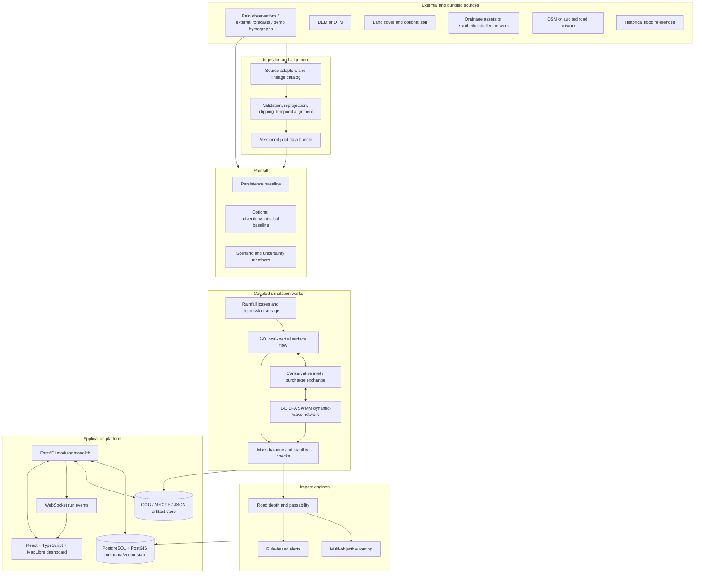

# SIH26085 Urban Flood Nowcasting System — Proposed Architecture

**Status:** Phase 0 proposal; scientific and pilot-area choices require human approval before implementation
**Last updated:** 2026-08-21
**Repository baseline:** only `README.md` was present at the start of Phase 0

## 1. Purpose and claim boundary

UFNS will be a reproducible, student-scale prototype that couples rainfall forcing, terrain-controlled surface flow, a 1-D storm-drain model, street exposure, and flood-aware routing for a 0–180 minute forecast window.

The prototype will demonstrate the coupling and its consequences. It will **not** claim calibrated street-level accuracy, operational status, or public-safety suitability until it has suitable local terrain, drainage asset data, observations, and independent validation.

Every run will expose provenance at the layer and output level:

- `OBSERVED_REALTIME`
- `OBSERVED_HISTORICAL`
- `EXTERNAL_FORECAST`
- `SIMULATED_SCENARIO`
- `STATIC_REFERENCE`
- `MODEL_PREDICTION`
- `DERIVED`

The dashboard must display human-readable equivalents such as **REAL DATA**, **HISTORICAL DATA**, **SIMULATED DATA**, and **MODEL PREDICTION**. Resampling a coarse rainfall product or DEM does not increase its true information resolution; both native and working resolutions will be displayed.

## 2. Phase 0 findings

### Repository

- No application, tests, configuration, or data are present.
- No previous agent state or decision log existed.
- The architecture is therefore greenfield and no working subsystem needs migration.

### Available sandbox compute

Measured on 2026-08-21:

| Resource | Available |
|---|---:|
| CPU | 2 vCPU, Intel Xeon at approximately 2.60 GHz |
| RAM | 3.8 GiB, no swap |
| Disk | approximately 20 GiB free |
| GPU | none visible |
| Python | 3.11.2 |
| Node.js / npm | 22.22.3 / 10.9.8 |
| Docker, GDAL, PostgreSQL client | not preinstalled |

This environment favors one deployable backend, a bounded raster domain, CPU-vectorized numerical work, and no mandatory deep-learning or GPU path. Dependency installation and Docker feasibility must be verified during implementation. The target should also run on a typical student laptop with at least 4 CPU cores and 8 GiB RAM; the current sandbox is the stricter benchmark.

### Data availability

No datasets are stored in this repository. Open candidates and access constraints are catalogued in [DATA_SOURCES.md](DATA_SOURCES.md). The main unresolved gap is a hydraulically usable local drainage model: linework exists for some cities, but pipe dimensions, inverts, inlet properties, outlet levels, pumps, and condition are generally absent or unaudited.

## 3. Scientifically credible MVP

The minimum credible prototype is intentionally bounded:

1. A configurable urban pilot domain of about **4 km × 4 km**.
2. A terrain grid at the **native trustworthy DEM resolution** (30 m with currently identified open global data). A 10 m working grid is allowed only when a defensible higher-resolution terrain product is supplied; upsampling a 30 m DEM must not be presented as 10 m terrain.
3. Deterministic scenario rainfall at 15-minute intervals, plus a persistence forecast baseline. External weather forecasts may be shown only with their true source and resolution.
4. Land-cover-dependent runoff losses and depression storage with all parameters recorded.
5. A tested, conservative 2-D local-inertial overland-flow solver based on an established implementation, proposed as Landlab `OverlandFlow` (de Almeida/Bates formulation).
6. EPA SWMM dynamic-wave drainage hydraulics, driven through a Python interface, with inlet capture and surcharge exchanged with surface cells.
7. Four deterministic, clearly labelled simulation scenarios: normal, heavy, extreme, and extreme plus blockage.
8. Per-timestep flood depth, extent, drainage state, road exposure, alerts, and traceable mass-balance diagnostics.
9. Three route objectives—fastest, lower-exposure, and emergency-profile—computed on a road graph whose costs actually change with modelled road depth.
10. A MapLibre operational dashboard with a 0–180 minute timeline and explicit provenance/limitations.

With a 30 m DEM this is a **neighbourhood-scale screening model whose outputs are associated with street segments**; it is not a curb-scale street hydraulic model. Credible curb-scale claims generally require surveyed/LiDAR terrain, building/kerb representation, surveyed drainage, and calibration.

## 4. Proposed logical architecture



## 5. Deployment shape: modular monolith, not premature microservices

The repository can preserve scientific module boundaries without paying the operational cost of independent services.

### Runtime processes

1. **Web:** static React/TypeScript application served by a lightweight web server.
2. **API:** FastAPI process containing ingestion orchestration, query APIs, routing, and run management.
3. **Simulation worker:** a bounded child process/process pool invoked by the API so CPU-bound numerical work does not block HTTP. One concurrent simulation by default on constrained hardware.
4. **Database:** PostgreSQL/PostGIS in the full profile; SQLite/GeoPackage-like local persistence may be considered only for a no-Docker demo profile and must implement the same repository interfaces.
5. **Artifact store:** local mounted filesystem for the demo, replaceable by S3-compatible storage.

Redis and an external queue are stretch infrastructure, justified only if multiple concurrent users are demonstrated. Kubernetes is out of scope.

### Proposed code boundaries after approval

```text
apps/
  api/                 FastAPI composition, API schemas, persistence adapters
  web/                 React, TypeScript, MapLibre dashboard
services/
  ingestion/           Source adapters, CRS/time/unit checks, pilot bundle builder
  rainfall/            Persistence and optional forecasting baselines
  hydrology/            Loss model and 2-D overland-flow adapter
  hydraulics/           SWMM adapter and inlet/surcharge coupling
  simulation/          Run orchestration, mass ledger, artifact generation
  routing/             Road graph, risk sampling, route objectives
models/                 Model cards and optional trained artifacts
infrastructure/
  docker/               Images and entry points
  deployment/           Student-scale deployment configuration
data/
  raw/                  ignored; immutable downloads with manifests
  processed/            ignored; reproducible build outputs
  demo/                 only small, licence-compatible deterministic fixtures
scripts/                Data preparation, demo and benchmark commands
tests/                  unit, integration, scientific regression and end-to-end tests
docs/                   architecture, data, assumptions, decisions and presentation
```

Packages will expose typed interfaces; one service must not reach into another service's private implementation.

## 6. Coordinate, grid, and time policy

### Horizontal CRS

- External API and web-map interchange: **OGC:CRS84/EPSG:4326 coordinates in longitude, latitude order**, with the exact contract stated at each boundary.
- Numerical simulation and metric geometry: a local projected CRS in metres, selected from the pilot area and persisted as an EPSG identifier or WKT2.
- Proposed examples only: Kolkata is in UTM zone 45N (`EPSG:32645`); Bengaluru is in UTM zone 43N (`EPSG:32643`). The actual CRS is selected only after the pilot is approved.
- A run is rejected when a source has no CRS, an implausible extent, or cannot be transformed. The ingestion report may allow an explicit human override; no silent CRS guessing.

### Vertical reference

- Preserve the DEM's vertical datum/height reference in metadata.
- Drain invert, ground, outlet, and surface elevations must share a known vertical reference before representing a real network.
- If network invert levels are unavailable, generated values are `ASSUMED` and the run is a simulated drainage scenario, even if its plan geometry came from real data.

### Grid

- Pilot default with identified global data: 30 m square cells.
- Configurable cell size; reject a requested grid that implies false native precision without an explicit `resampled=true` quality flag.
- One canonical grid per pilot bundle: same extent, transform, shape, projected CRS, nodata mask, and orientation for DEM, roughness, losses, forcing, and depth.
- Buildings, kerbs, underpasses, and culverts are unresolved at 30 m. DEM preprocessing must not indiscriminately fill real urban depressions. Any conditioning operation is versioned and recorded.

### Time

- Store and exchange timestamps as timezone-aware UTC using RFC 3339.
- Display local time separately with the named IANA timezone.
- Forecast issue time, valid time, and lead time are distinct fields.
- Proposed rainfall forcing interval: 15 minutes.
- Proposed output snapshot interval: 5 minutes.
- Surface/SWMM numerical timesteps are seconds and adaptive/bounded for stability; they are not tied to the output interval.
- Required lead snapshots include now, +15, +30, +60, +120, and +180 minutes.

## 7. Data contracts

All contracts include `schema_version`, stable IDs, source lineage, quality flags, units, CRS where spatial, and UTC timestamps. Python validation models and generated OpenAPI/JSON Schema will be the executable source of truth. The shapes below are design contracts, not final serialization syntax.

### 7.1 Common lineage

```yaml
DataLineage:
  dataset_id: string
  version: string
  source_name: string
  source_url: uri | null
  licence_id: string | null
  acquired_at: datetime_utc
  content_sha256: string
  provenance_class: enum
  quality_flags: [enum]
  native_crs: string | null
  native_resolution: {x: number, y: number, unit: string} | null
  processing_steps: [string]
```

`quality_flags` include `VALIDATED`, `ASSUMED_PARAMETER`, `RESAMPLED`, `STALE`, `MISSING_VALUES`, `PARTIAL_COVERAGE`, `UNVALIDATED_SOURCE`, and `SYNTHETIC`.

### 7.2 Raster grid and rainfall

```yaml
GridSpec:
  grid_id: string
  crs_wkt_or_epsg: string
  vertical_crs: string | null
  width: integer
  height: integer
  affine_transform: [a, b, c, d, e, f]
  cell_size_m: number
  nodata: number | null
  bounds: [xmin, ymin, xmax, ymax]

RainfallGrid:
  rainfall_id: string
  issue_time: datetime_utc
  valid_from: datetime_utc
  valid_to: datetime_utc
  lead_minutes: integer
  grid: GridSpec
  variable: rainfall_rate
  units_external: mm/h
  units_solver: m/s
  source_resolution: object
  source: DataLineage
  confidence: number | null
  asset_uri: string
```

Rainfall gridded assets use CF-compatible NetCDF/Zarr for time series or Cloud-Optimized GeoTIFFs per interval. `confidence` remains null unless a defensible method creates it.

### 7.3 Terrain and land surface

```yaml
TerrainBundle:
  bundle_id: string
  grid: GridSpec
  dem_asset_uri: string
  dem_units: m
  roughness_asset_uri: string
  roughness_units: s/m^(1/3)
  infiltration_parameter_asset_uris: object
  depression_storage_asset_uri: string
  source_lineage: [DataLineage]
  conditioning_report_uri: string
```

### 7.4 Surface output

```yaml
FloodSnapshot:
  prediction_id: string
  simulation_id: string
  model_version: string
  valid_time: datetime_utc
  lead_minutes: integer
  grid: GridSpec
  depth_asset_uri: string
  depth_units: m
  velocity_asset_uri: string | null
  velocity_units: m/s | null
  extent_threshold_m: number
  provenance_class: MODEL_PREDICTION
  quality_flags: [enum]
  mass_balance: MassBalance
```

A vector `FloodCell` view is generated only for API/map queries; the numerical source remains raster:

```yaml
FloodCell:
  cell_id: string
  geometry: polygon
  crs: string
  elevation_m: number
  water_depth_m: number
  velocity_m_s: number | null
  flood_probability: number | null
  severity: enum
  valid_time: datetime_utc
```

`flood_probability` is null in deterministic runs. Scenario-member exceedance frequency is not called probability unless the ensemble weights are scientifically justified.

### 7.5 Drainage

```yaml
DrainageNode:
  node_id: string
  geometry: point
  crs: string
  node_type: inlet | junction | storage | outfall
  ground_elevation_m: number
  invert_elevation_m: number
  max_depth_m: number
  inlet_capture_definition: object | null
  parameter_status: measured | published | derived | assumed

DrainageLink:
  link_id: string
  from_node_id: string
  to_node_id: string
  geometry: linestring
  length_m: number
  shape: string
  diameter_or_dimensions_m: object
  roughness_n: number
  slope: number
  blockage_fraction: number
  parameter_status: measured | published | derived | assumed

DrainageState:
  simulation_id: string
  valid_time: datetime_utc
  node_head_m: number
  inflow_m3_s: number
  surcharge_m3_s: number
  link_flow_m3_s: number
  capacity_ratio: number | null
  state: normal | near_capacity | surcharged | backflow | blocked
```

### 7.6 Road risk and route

```yaml
RoadSegmentRisk:
  road_id: string
  geometry: linestring
  valid_time: datetime_utc
  base_travel_time_s: number
  max_depth_m: number
  p95_depth_m: number
  wet_length_m: number
  passability: open | penalized | closed | unknown
  routing_cost_s: number | null
  source_prediction_id: string
  quality_flags: [enum]

RouteRequest:
  origin: {longitude: number, latitude: number}
  destination: {longitude: number, latitude: number}
  departure_or_valid_time: datetime_utc
  objective: fastest | lower_exposure | emergency
  vehicle_profile: string

RouteOption:
  route_id: string
  objective: enum
  geometry: linestring
  eta_s: number
  distance_m: number
  maximum_depth_m: number
  flooded_length_m: number
  exposure_score: number
  closed_edges_avoided: integer
  explanation: [string]
  prediction_id: string
```

The term **safe route** in the UI means “lower modelled flood exposure under the configured profile,” not a guarantee of safety.

### 7.7 Run trace and mass balance

```yaml
SimulationRun:
  simulation_id: uuid
  created_at: datetime_utc
  forecast_issue_time: datetime_utc
  mode: demo | live
  scenario_id: string
  status: queued | running | succeeded | failed | cancelled
  model_versions: object
  input_dataset_versions: object
  parameters: object
  output_manifest_uri: string | null
  failure: object | null

MassBalance:
  interval_start: datetime_utc
  interval_end: datetime_utc
  rainfall_input_m3: number
  external_inflow_m3: number
  infiltration_loss_m3: number
  surface_boundary_outflow_m3: number
  drainage_outfall_m3: number
  initial_surface_storage_m3: number
  final_surface_storage_m3: number
  initial_drain_storage_m3: number
  final_drain_storage_m3: number
  residual_m3: number
  relative_error: number | null
  status: pass | warning | fail
```

Surface–drain exchange is internal and must cancel from the whole-system ledger.

## 8. Coupled simulation sequence

For each run:

1. Resolve a versioned pilot bundle and validate all grid, CRS, vertical-reference, nodata, timestamp, and unit constraints.
2. Select rainfall source/forecast/scenario and align it to the canonical grid. Record native resolution and interpolation method.
3. Initialize surface depth, cumulative losses/depression storage, SWMM state, and a mass ledger.
4. For each forcing interval:
   1. Compute available rainfall and physically accounted losses.
   2. Advance 2-D surface flow with adaptive stable substeps.
   3. At configured coupling exchanges, compute inlet capture from surface head and SWMM node head, capped by available cell volume and inlet capacity.
   4. Apply captured flow to SWMM, advance SWMM dynamic wave, and return node surcharge/backflow to the mapped surface cell(s).
   5. Write exchange volumes to both component ledgers with opposite signs.
   6. Reject/stop on NaN, material negative depth, failed solver status, or unacceptable continuity error.
5. Save depth/state snapshots, mass-balance diagnostics, and model/source versions.
6. Sample depth onto roads, update graph passability/cost, compute routes and alerts.
7. Publish progress/snapshot events to the UI.

A coupling spike must verify that the chosen SWMM Python API can update lateral inflow and expose head/flooding at substeps without losing continuity. If this cannot be demonstrated, implementation pauses for a reviewed adapter decision rather than replacing SWMM with undocumented custom hydraulics.

## 9. Persistence design

### PostgreSQL/PostGIS schemas

- `catalog`: source datasets, licences, checksums, versions, quality reports
- `core`: pilot areas, grids, configurations, model versions
- `rainfall`: forecast metadata and asset references
- `drainage`: nodes, links, inlets, outlets, scenario overrides
- `roads`: graph nodes/edges and base travel attributes
- `simulation`: runs, parameters, status, snapshot metadata, mass diagnostics
- `impact`: road risk, route summaries, alerts

Large raster/time-cube values remain immutable COG/NetCDF/Zarr artifacts with checksums and database references. This avoids turning PostGIS into a bulk result-file store while retaining spatially indexed vectors and metadata.

### Idempotency and retention

- A run fingerprint hashes input versions, model versions, parameters, grid, and forecast issue time.
- Repeating an identical deterministic run may return the existing artifact.
- Raw source files are immutable; processed bundles are rebuilt into new versions.
- Demo outputs can be pruned by age; manifests remain for traceability.

## 10. Proposed API

All endpoints are versioned under `/api/v1`; `/health` remains unversioned for infrastructure.

| Method | Path | Purpose |
|---|---|---|
| GET | `/health` | Liveness, dependency readiness, model versions |
| GET | `/api/v1/pilots` | Pilot extents, CRS, data readiness and limitations |
| GET | `/api/v1/rainfall/current` | Latest source-labelled rainfall |
| GET | `/api/v1/rainfall/forecast` | Issue/valid-time rainfall sequence |
| POST | `/api/v1/simulations` | Validate and queue a run |
| GET | `/api/v1/simulations/{id}` | Run status, lineage and diagnostics |
| GET | `/api/v1/simulations/{id}/snapshots` | Timeline metadata and signed/local asset URLs |
| GET | `/api/v1/flood/current` | Latest successful depth/extent for a pilot |
| GET | `/api/v1/flood/forecast` | Forecast snapshot catalog |
| GET | `/api/v1/drainage/status` | Node/link state at requested valid time |
| GET | `/api/v1/roads/risk` | Road risk at requested valid time |
| POST | `/api/v1/routes` | Compute route options using a selected prediction |
| GET | `/api/v1/alerts` | Rule-derived alerts with provenance |
| WS | `/api/v1/simulations/{id}/events` | Progress, diagnostics, snapshot-ready and failure events |

`POST /simulations` returns `202 Accepted` with a simulation ID. API errors use a stable machine-readable envelope with correlation ID and never hide model failures. File paths supplied by clients are not accepted; uploads, if later enabled, use bounded size/type validation and quarantine.

## 11. Rainfall forecasting policy

Implementation order:

1. **Persistence:** current observed/estimated rainfall field held over lead time.
2. **Simple statistical/advection baseline:** only after enough ordered fields exist; evaluate against persistence with rolling-origin splits.
3. **Small ML model:** only if a documented training dataset, leakage-safe split, and measurable improvement exist.
4. **Deep spatiotemporal model:** stretch only; no GPU dependency for the operational demo.

External NWP point/grid forecasts are identified as `EXTERNAL_FORECAST`, not observations and not locally downscaled nowcasts. Forecast skill is not inferred from flood-map appearance.

## 12. Flood-aware routing design

1. Build and freeze a versioned directed drivable graph from OSM/audited roads.
2. Derive base travel time from explicit speed tags or documented class defaults; flag imputation.
3. Sample each forecast depth raster along a buffered road segment using max, p95, and wet length rather than a single midpoint.
4. Apply a configurable vehicle profile:
   - shallow depth: penalty;
   - deeper depth: stronger nonlinear penalty;
   - profile closure threshold: remove edge from the graph;
   - unknown/nodata: uncertainty penalty or exclusion, not assumed dry.
5. Compute:
   - **Fastest:** base travel time, annotated with exposure;
   - **Lower exposure:** base time plus depth/duration/uncertainty cost with closed edges removed;
   - **Emergency:** separately reviewed vehicle thresholds and priorities; never automatically permits severe flooding.
6. Return route trade-offs and the specific avoided flooded/closed segments.

Route thresholds are configurable demonstration policy, not universal safety standards.

## 13. Frontend information architecture

### Main operational view

- Full map with flood depth, rainfall, drainage, road risk, vulnerable assets, and route layers.
- Timeline for now, +15, +30, +60, +120, +180 with 5-minute snapshots available.
- Scenario controls separated from live source controls.
- Provenance badges and last-update/forecast-issue/valid-time labels always visible.
- Risk summary with affected road length, closed segments, surcharged nodes, mass-balance warning, and active alerts.
- Click inspection shows source, native resolution, units, model version, parameter status, and limitation.
- Side-by-side scenario comparison is preferred for the no-blockage versus blockage demonstration.

Depth palettes and legends must be accessible and quantitative. A simulation animation may interpolate display frames but must not imply model outputs at times that were not produced.

## 14. Observability and failure behavior

- JSON structured logs: timestamp, level, service, simulation ID, correlation ID, event, duration, model/source versions.
- Timers for ingestion, alignment, rainfall inference, surface simulation, SWMM, coupling, artifact writing, road sampling, routing, and API latency.
- Health reports distinguish process liveness from database/artifact/model readiness.
- Run status includes the exact failed stage and diagnostic artifact.
- Prometheus-compatible metrics are a stretch; structured benchmark output is MVP.
- No silent fallback from live to simulation mode. A failed external source is shown as unavailable/stale.

## 15. Security and operational controls

- Secrets only through environment variables; commit `.env.example`, never `.env`.
- Explicit CORS origins; no wildcard in deployed profiles.
- Pydantic request validation, bounded scenario duration/domain, finite numeric checks, and allowlisted scenario IDs.
- Rate-limit simulation creation and cap concurrent workers.
- Pin dependencies and scan committed fixtures for secrets/licence violations.
- Attribute all map/data providers in the dashboard and documentation.

## 16. Validation strategy

### Numerical and scientific tests

- zero rain/zero initial water remains dry;
- uniform rain on an impermeable closed bowl gives the analytical stored volume;
- rainfall-loss-depth unit conversions;
- planar-slope runoff hydrograph compared with an analytical/accepted benchmark where applicable;
- wetting/drying and disconnected depression benchmark;
- UK Environment Agency benchmark Test 8A (rainfall/point-source urban surface flow) and 8B (surcharging sewer) as staged scientific benchmarks;
- SWMM's own runoff/flow-routing continuity reports;
- coupled surface–drain exchange conserves equal and opposite volume;
- 0%, 25%, 50%, and 100% blockage produce a physically explainable hydraulic change; monotonic flood increase is expected only for controlled test networks where alternate paths cannot reverse the relationship;
- no NaN/inf, material negative depth, impossible timestamp order, or CRS mismatch;
- sensitivity to cell size, timestep controls, roughness, losses, inlet capacity, and boundary conditions.

### Integration

`rainfall -> losses -> surface flow <-> drainage -> depth snapshots -> road risk -> route`

The test asserts data lineage and mass ledger, not just HTTP status.

### Real-event evaluation

If suitable event rainfall and independent flood extent/depth observations are acquired, use held-out events and report IoU/precision/recall/F1 and depth MAE/RMSE with spatial alignment and uncertainty documented. Until then the UI and model card state:

> Evaluation unavailable due to lack of a suitable independent reference dataset.

## 17. Performance budget

Initial benchmark target—not a measured claim:

- canonical domain: approximately 4 km × 4 km;
- 30 m grid: roughly 18,000 active cells before masking;
- 180-minute event;
- one concurrent run on 2 vCPU / 4 GiB;
- goal: complete a deterministic demo run faster than its 3-hour simulated horizon, then optimize toward a judge-friendly under-2-minute preconfigured run;
- API non-simulation queries: target p95 below 500 ms on local demo data;
- map delivery: tiled/generalized outputs, never all cells as a giant GeoJSON.

Actual timings, peak memory, cell counts, dependency versions, and hardware are written to `docs/BENCHMARKS.md` only after measurement.

## 18. Approval gates

Implementation should start only after the human team reviews these reversible but scientifically consequential choices:

1. **Pilot:** preferred path is a data-audited small West Bengal AMRUT urban area because candidate drain and vent vectors exist; Bengaluru is a fallback because primary/secondary/tertiary drain linework is published. Neither is accepted until schema, geometry, licence, elevation, and hydraulic attribute audits pass.
2. **Surface solver:** Landlab local-inertial `OverlandFlow`, wrapped and benchmarked rather than a novel solver.
3. **Drain solver:** EPA SWMM dynamic wave with conservative two-way surface exchange.
4. **Resolution/domain:** 30 m / about 4 km × 4 km with available global DEM, upgraded only with defensible terrain.
5. **Data-limited drainage:** use real audited plan geometry where possible but label assumed hydraulic attributes; include a fully deterministic synthetic network fixture for reproducibility and solver tests.
6. **Thresholds:** all depth severity and vehicle passability defaults are demonstration configuration pending review by hydrology/disaster-management experts.

Decisions and alternatives are recorded in [DECISIONS.md](DECISIONS.md). Scientific equations and proposed parameter policy are in [MODEL_ASSUMPTIONS.md](MODEL_ASSUMPTIONS.md).
